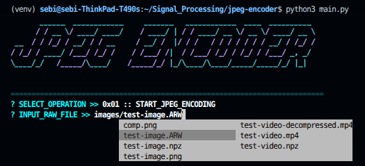
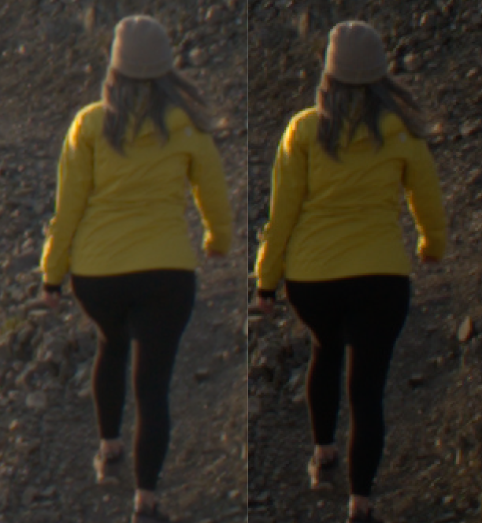

# JPEG Encoder/Decoder

## Implementation Overview

**Task 1 - Full JPEG Algorithm:** Implemented complete encoding pipeline with 8x8 block splitting, DCT transformation via `scipy.fft.dctn`, JPEG quantization, zigzag scanning, and Huffman encoding. Decoding pipeline reverses all operations to reconstruct the image.

**Task 2 - Color Support:** Extended algorithm for RGB images with Y'CbCr color space conversion using standard transformation matrices. Luminance channel (Y) is DC-shifted by -128 before DCT processing.

**Task 3 - MSE-Based Compression:** Implemented binary search algorithm to automatically determine optimal quality factor based on user-specified MSE threshold, with weighted MSE calculation (60% Y, 20% Cb, 20% Cr).

**Task 4 - Video Compression:** Extended algorithm for video files by extracting frames with OpenCV and processing each as an independent JPEG image. Quality factor is computed from the first frame and reused for subsequent frames. Parallel frame processing with `ThreadPoolExecutor` and serialization to `.npz` format with preserved metadata (fps, frame count).


## How to Run

```bash
python3 -m venv venv
source ./venv/bin/activate
pip install -r requirements.txt
python3 main.py
```

## Usage Guide




### Interface Navigation
- Use **arrow keys** to navigate between options
- Press **Enter** to select an operation
- Press **Tab** for file path autocompletion
- Follow the prompts to input file paths and parameters

### Testing with Sample Files

**Image Compression/Decompression:**
1. Select `0x01 :: START_JPEG_ENCODING`
2. Input path: `images/test-image.npz`
3. Set MSE threshold
4. Output: `images/test-image.npz` (compressed)
5. Select `0x02 :: START_JPEG_DECODING`
6. Input path: `images/test-image.npz`
7. Output: `images/test-image.png` (reconstructed)

**Video Compression/Decompression:**
1. Select `0x03 :: START_JPEG_VIDEO_ENCODING`
2. Input path: `images/test-video.npz`
3. Set MSE threshold
4. Output: `images/test-video.npz` (compressed)
5. Select `0x04 :: START_JPEG_VIDEO_DECODING`
6. Input path: `images/test-video.npz`
7. Output: `images/test-video_decompressed.mp4` (reconstructed)

Sample files are located in the `images/` directory.

## Compression Results

Visual comparison between original RAW (ARW) on the left and reconstructed PNG after JPEG compression, on the right:



The algorithm achieves significant compression while maintaining perceptual quality within the specified MSE threshold. The reconstructed image is saved as PNG (lossless format) to preserve the exact output of the decompression pipeline, highlighting purely the compression artifacts introduced by the JPEG algorithm without additional encoding losses.